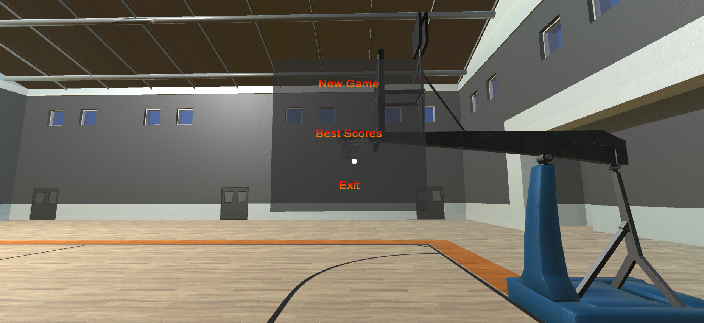
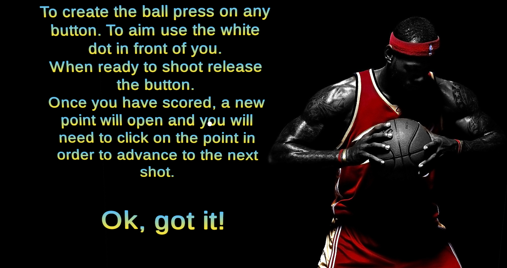
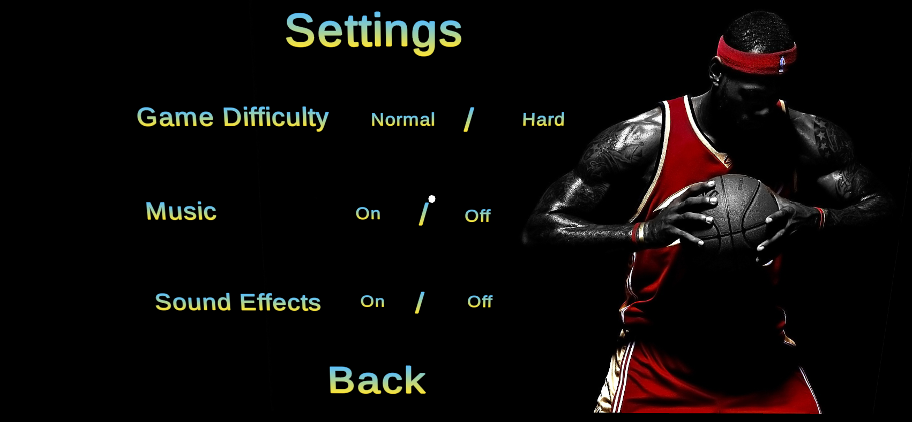
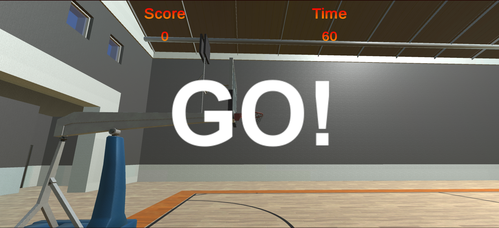
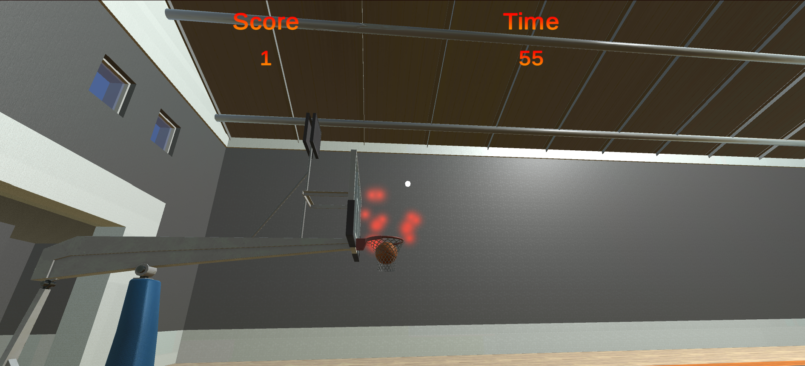
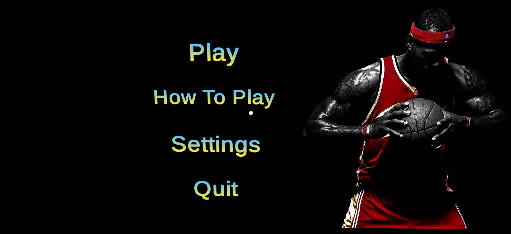
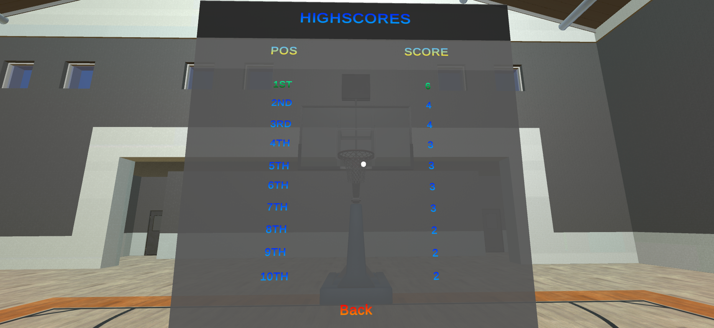

# Basketball Stations

Basketball Stations is android VR game I develop using Unity with C# and Google Cardboard XR.

## Screenshots









## Built With
* [Unity](https://unity.com/) - Unity is a cross-platform game engine developed

* [C#](https://docs.microsoft.com/en-us/dotnet/csharp/) -  is a general-purpose, multi-paradigm programming language encompassing static typing, strong typing, lexically scoped, imperative, declarative, functional, generic, object-oriented (class-based), and component-oriented programming disciplines.

* [Visual Studio ](https://visualstudio.microsoft.com/) - visual studio is  an integrated development environment (IDE) from Microsoft


```
